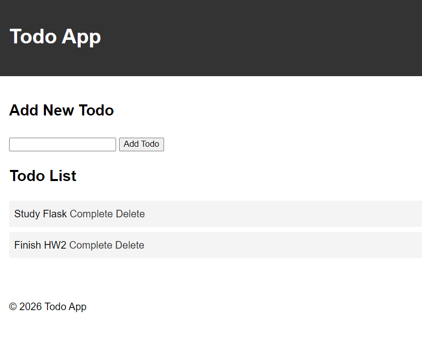
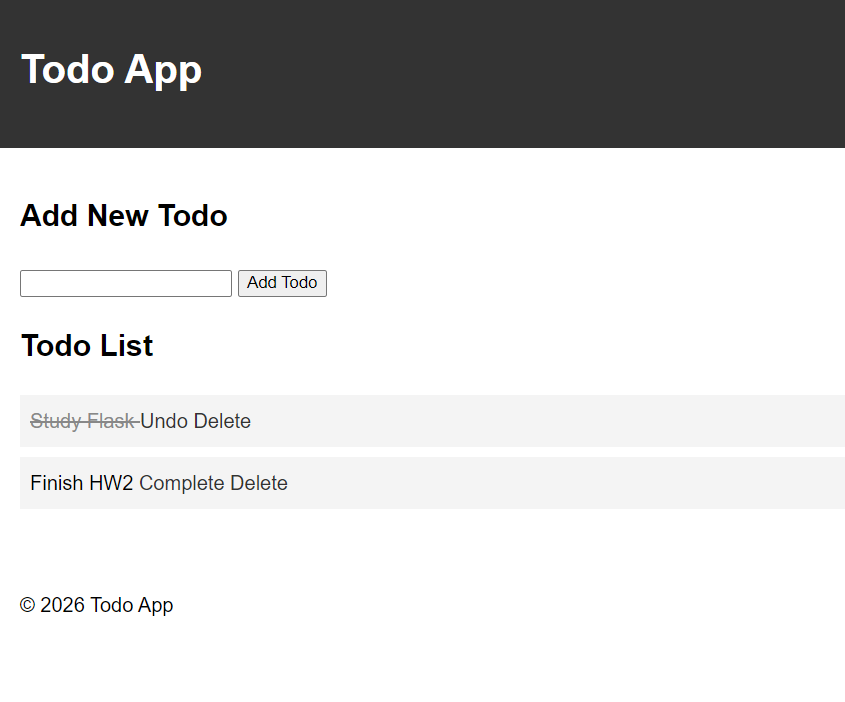
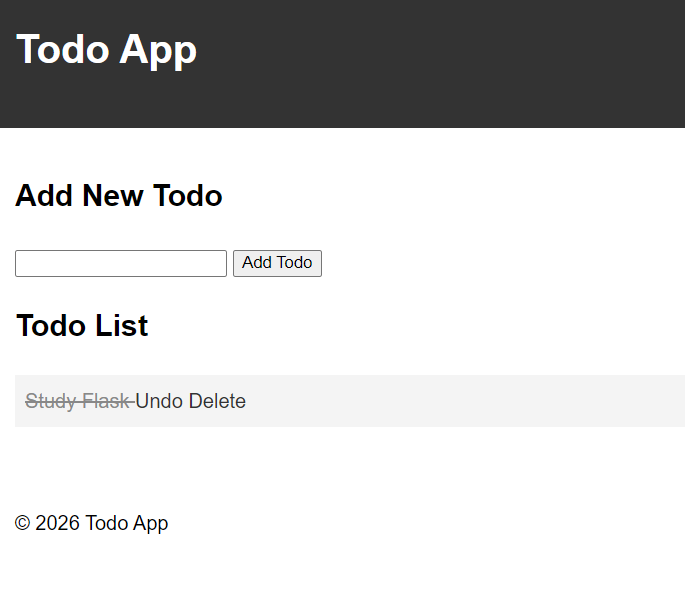

# HW2 - Flask Todo App

## 1. 과제 소개

Flask와 Jinja2 템플릿을 활용하여 간단한 Todo 웹 애플리케이션을 구현했습니다.

기존 Todo 앱에 완료 상태 변경(Toggle) 기능을 추가하여 할 일의 완료 여부를 관리할 수 있도록 했습니다.

## 2. 구현 기능

- **할 일 조회:** 등록된 할 일 목록 표시
- **할 일 추가(Add):** 새로운 할 일 등록
- **완료 상태 변경(Complete):** 할 일을 완료 상태로 변경하고 취소선 표시
- **완료 취소(Undo):** 완료된 할 일을 다시 미완료 상태로 변경
- **할 일 삭제(Delete):** 등록된 할 일 삭제

## 3. 실행 방법

프로젝트 루트 폴더에서 다음 명령어를 실행합니다.

```powershell
.\venv\Scripts\python.exe HW2\app.py
```

실행 후 브라우저에서 아래 주소로 접속합니다.

http://127.0.0.1:5000

## 4. 주요 구현 내용

### Todo 데이터 구조

기존 문자열 리스트를 딕셔너리 리스트로 변경하여 할 일과 완료 여부를 함께 저장했습니다.

```python
todos.append({
    'task': todo,
    'done': False
})
```

### 완료 상태 변경

`/toggle/<int:index>` 라우트를 추가하고 `not` 연산자를 사용하여 완료 상태를 변경했습니다.

```python
todos[index]['done'] = not todos[index]['done']
```

### 완료 항목 표시

Jinja2 조건문으로 완료 여부에 따라 Complete 또는 Undo 링크가 표시되도록 구현했습니다.

완료된 항목에는 CSS의 `text-decoration: line-through`를 적용했습니다.

## 5. 실행 화면

### ① 할 일 추가 및 목록 조회


### ② 할 일 완료 처리


### ③ 할 일 삭제


### ③ 완료 취소 및 삭제

(실행 화면 첨부 예정)

## 6. 참고 사항

Todo 데이터는 메모리에 저장되므로 서버를 종료하거나 재시작하면 초기화됩니다.