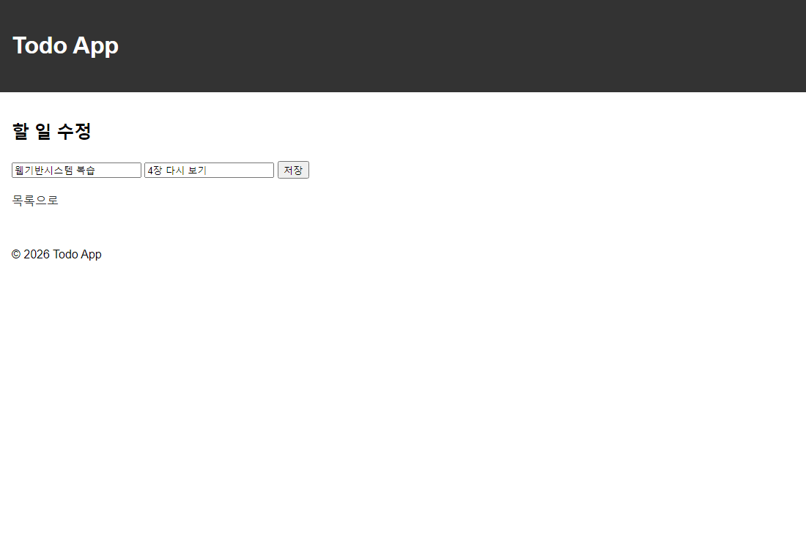
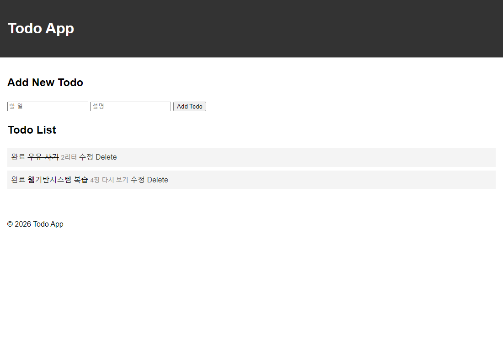

# HW3: Todo 앱 수정 기능

설명(note) 입력과 수정 화면을 추가했습니다. HW3는 SQLite를 사용하며 instance/todo.db가 자동 생성됩니다.

## 실행

저장소 루트의 PowerShell에서 실행합니다.

```powershell
.\venv\Scripts\Activate.ps1
python -m pip install -r requirements.txt
cd HW3
flask --debug run
```

http://127.0.0.1:5000 에 접속합니다.

## 확인한 기능

- 할 일과 설명 추가 및 조회
- 완료 전환과 취소선 표시
- 기존 값이 채워진 수정 화면과 저장
- 항목 삭제
- 서버 종료 및 재시작 후 데이터 유지

## 실행 화면

### 1. 목록


### 2. 수정 화면


### 3. 서버 재시작 후 목록
서버 프로세스를 종료하고 새 프로세스를 실행하여 확인했습니다.


instance/는 Git에서 제외합니다. db.create_all()이 없는 테이블을 생성합니다.
제출은 HW1·HW2와 같은 GitHub 저장소 주소입니다.
